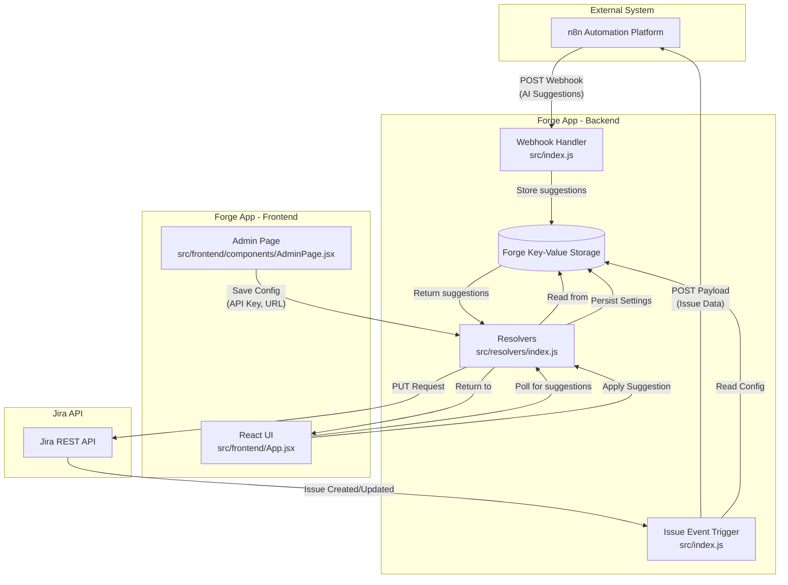
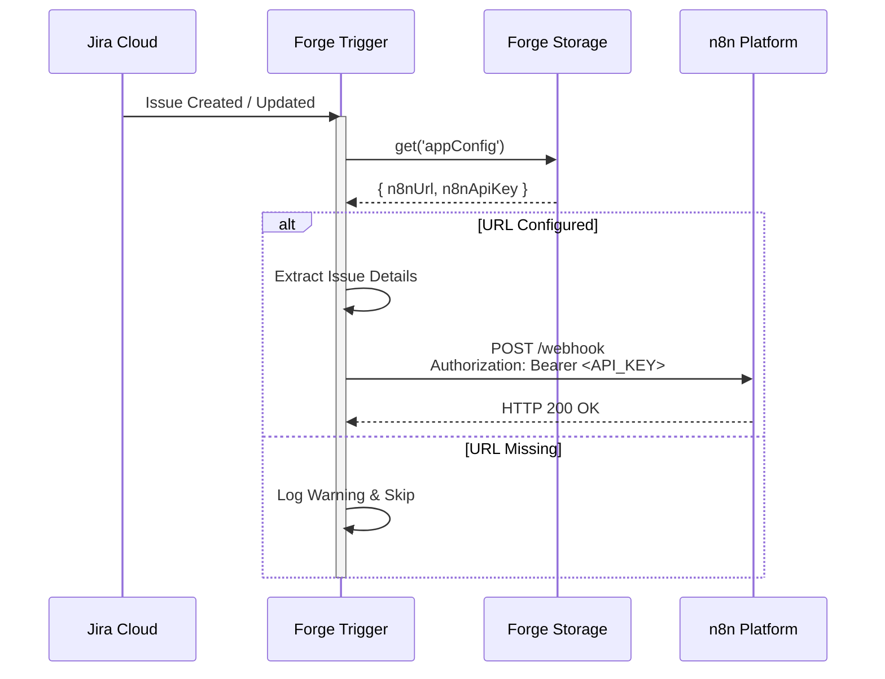
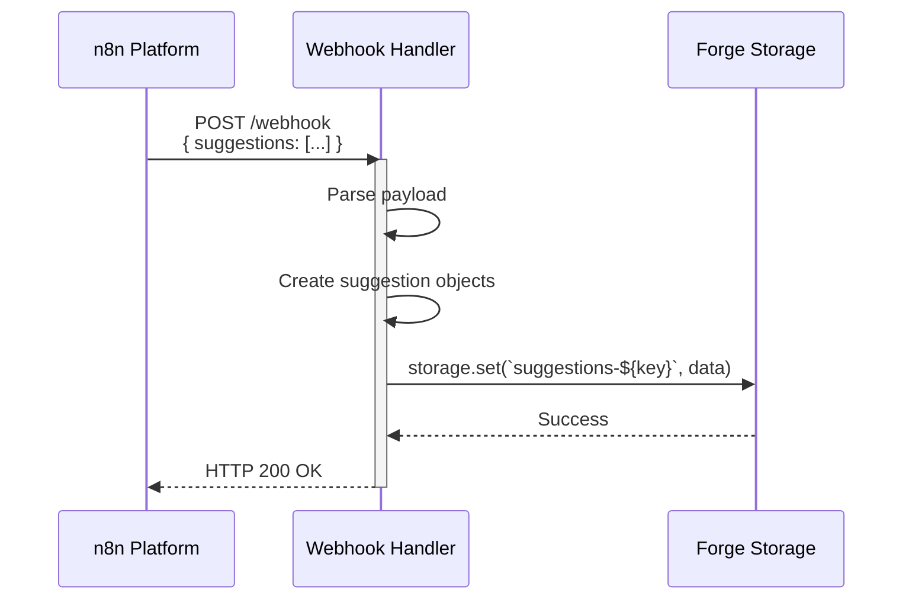
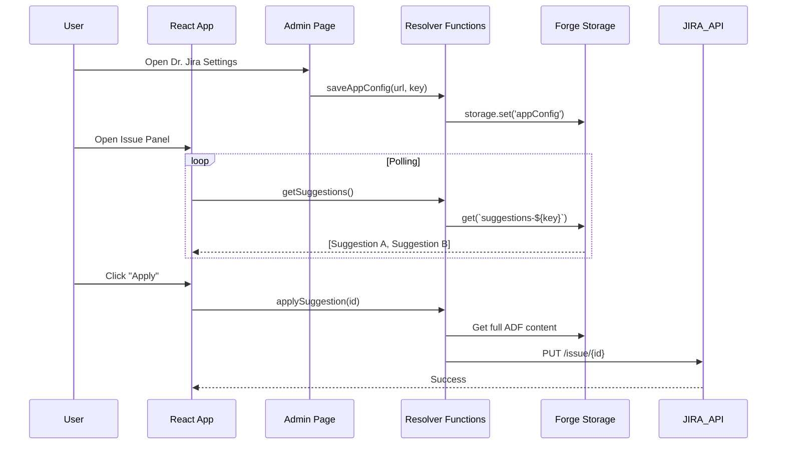

# AI-Suggest Flow Diagram & Function Specifications

This document provides a comprehensive overview of the data flow, function inputs/outputs, and system architecture for the AI-Suggest Forge app.

## System Architecture Overview



## Data Flow: Issue Event Trigger (Jira → n8n)



## Data Flow: Webhook Response (n8n → Storage)



## Data Flow: Frontend & Admin (UI → Storage/Jira)



## Configuration & Storage Keys

### Storage Keys
- `appConfig`: Stores global settings.
  ```json
  {
    "n8nUrl": "https://...",
    "n8nApiKey": "secret-key",
    "minScore": 80,
    "modelName": "GPT-4"
  }
  ```
- `suggestions-{issueKey}`: Stores the latest AI suggestions for a specific issue.
- `quality-{issueKey}`: Stores quality/metrics data (if applicable).

### Trigger Integration
- **Function:** `trigger` in `src/index.js`
- **Events:** `avi:jira:created:issue`, `avi:jira:updated:issue`
- **Logic:**
    1. Reads `appConfig` from storage.
    2. Fallback to process environment variables (`N8N_WEBHOOK_URL`).
    3. Sends full issue payload to the configured n8n URL.
