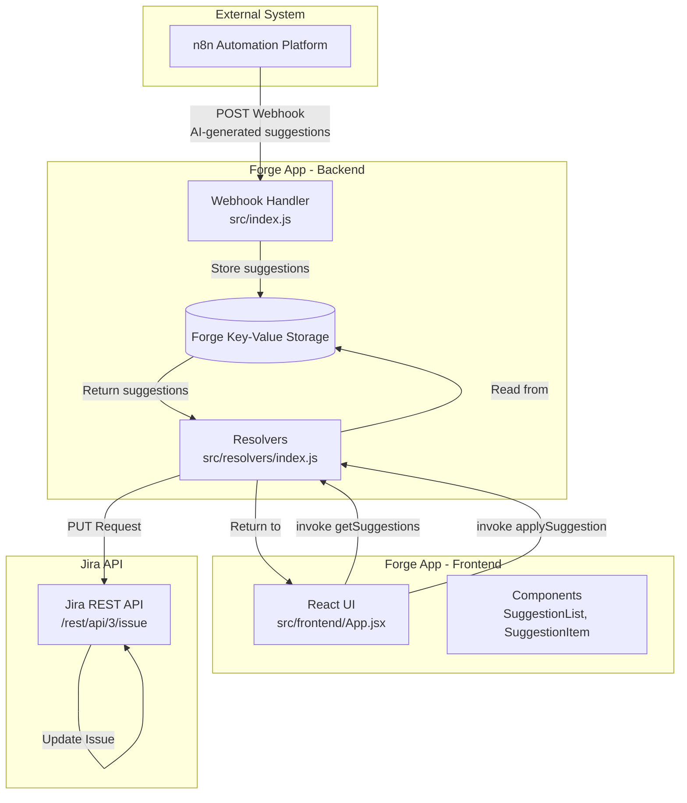
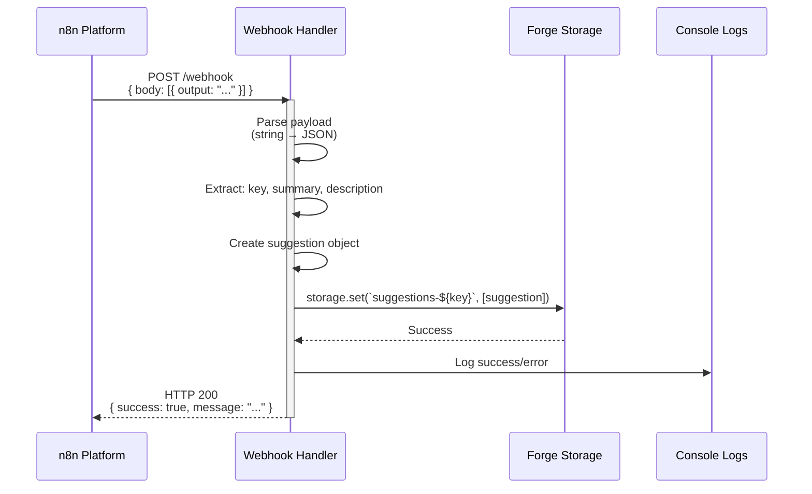
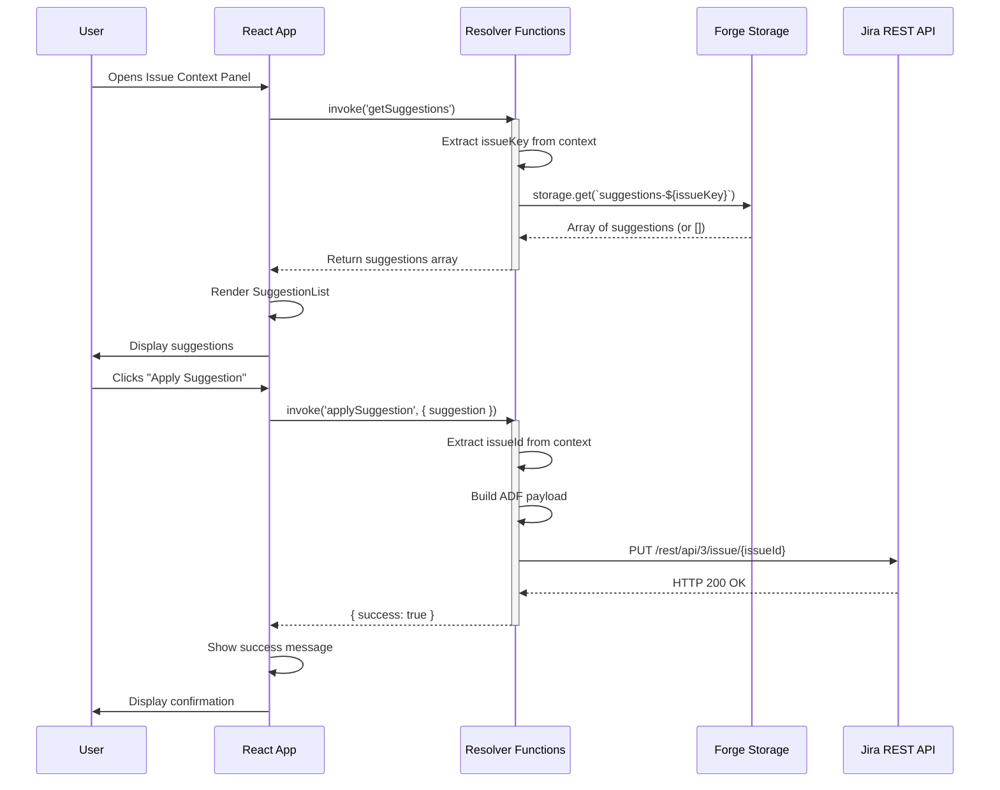

# AI-Suggest Flow Diagram & Function Specifications

This document provides a comprehensive overview of the data flow, function inputs/outputs, and system architecture for the AI-Suggest Forge app.

## System Architecture Overview



## Data Flow: Webhook Path (n8n → Storage)



## Data Flow: Frontend Path (UI → Jira API)



## Function Specifications

### 1. Webhook Handler (`webhook`)

**Location:** `src/index.js`

**Purpose:** Receives AI-generated suggestions from n8n and stores them in Forge Storage.

**Input:**
```typescript
req: {
  body: string | Array<{
    output: string  // Stringified JSON containing issue data
  }>
}
```

**Expected Payload Format:**
```json
[
  {
    "output": "{\"key\":\"GS-64\",\"summary\":\"Enhance AI Search\",\"description\":{...ADF...}}"
  }
]
```

**Processing Steps:**
1. Parse body (handle string or object)
2. Extract first item from array
3. Parse `item.output` string to JSON
4. Extract: `key`, `summary`, `description`
5. Create preview text from ADF description
6. Build suggestion object
7. Store in Forge Storage

**Output:**
```typescript
// Success
{
  statusCode: 200,
  headers: { 'Content-Type': 'application/json' },
  body: JSON.stringify({ 
    success: true, 
    message: `Stored suggestion for issue ${key}` 
  })
}

// Error (400)
{
  statusCode: 400,
  headers: { 'Content-Type': 'application/json' },
  body: JSON.stringify({ 
    error: 'Missing key or description in payload' 
  })
}

// Error (500)
{
  statusCode: 500,
  headers: { 'Content-Type': 'application/json' },
  body: JSON.stringify({ 
    error: 'Internal Server Error: ' + error.message 
  })
}
```

**Storage Key Format:** `suggestions-${issueKey}` (e.g., `suggestions-GS-64`)

**Storage Value Format:**
```typescript
Array<{
  id: string,                    // Timestamp-based unique ID
  title: string,                 // Issue summary or 'AI Suggestion'
  description: string,            // Plain text preview (max 100 chars)
  originalDescription: object,   // Full ADF object
  llm: string,                   // 'n8n AI Agent'
  score: number                  // Match score (currently hardcoded to 95)
}>
```

---

### 2. Get Suggestions Resolver (`getSuggestions`)

**Location:** `src/resolvers/index.js`

**Purpose:** Retrieves stored suggestions for the current issue from Forge Storage.

**Input:**
```typescript
req: {
  context: {
    extension: {
      issue: {
        key: string  // Jira issue key (e.g., "GS-64")
      }
    }
  }
}
```

**Processing Steps:**
1. Extract `issueKey` from `req.context.extension.issue.key`
2. If no key found, return empty array
3. Query Forge Storage: `storage.get(\`suggestions-${issueKey}\`)`
4. Return suggestions array or empty array if none found

**Output:**
```typescript
// Success - with suggestions
Array<{
  id: string,
  title: string,
  description: string,
  originalDescription: object,  // ADF format
  llm: string,
  score: number
}>

// Success - no suggestions
[]

// Warning (logged, not thrown)
// If issueKey is missing, returns [] and logs warning
```

**Error Handling:**
- Missing issue key: Returns `[]` and logs warning (non-fatal)
- Storage errors: Propagated to caller

---

### 3. Apply Suggestion Resolver (`applySuggestion`)

**Location:** `src/resolvers/index.js`

**Purpose:** Updates a Jira issue description with the selected AI suggestion.

**Input:**
```typescript
req: {
  payload: {
    suggestion: {
      text?: string,                    // Legacy field (not used)
      originalDescription?: object,     // ADF object to apply
      description?: string              // Fallback plain text
    }
  },
  context: {
    extension: {
      issue: {
        id: string  // Jira issue ID (numeric string)
      }
    }
  }
}
```

**Processing Steps:**
1. Extract `suggestion` from `req.payload`
2. Extract `issueId` from `req.context.extension.issue.id`
3. Build ADF payload:
   - Use `suggestion.originalDescription` if available
   - Otherwise, create simple ADF from `suggestion.description` text
4. Construct Jira API request body
5. Make PUT request to `/rest/api/3/issue/{issueId}`
6. Handle response/errors

**Output:**
```typescript
// Success
{
  success: true
}

// Error (thrown)
Error: 'Could not determine issue ID from context.'
Error: 'Failed to update issue: {statusText}'
```

**Jira API Request:**
```typescript
PUT /rest/api/3/issue/{issueId}
Headers: {
  'Accept': 'application/json',
  'Content-Type': 'application/json'
}
Body: {
  fields: {
    description: {
      type: "doc",
      version: 1,
      content: [...]  // ADF content
    }
  }
}
```

**Error Handling:**
- Missing issue ID: Throws error
- Jira API failure: Logs error and throws with status text

---

## Frontend Component Specifications

### App Component (`App.jsx`)

**Location:** `src/frontend/App.jsx`

**State:**
```typescript
{
  suggestions: Array<Suggestion>,  // List of suggestions
  loading: boolean,                 // Loading state
  error: string | null,             // Error message
  successMessage: string | null     // Success confirmation
}
```

**Functions:**
- `useEffect`: On mount, calls `invoke('getSuggestions')`
- `handleApply(suggestion)`: Calls `invoke('applySuggestion', { suggestion })`

**Data Flow:**
```
Mount → invoke('getSuggestions') → Update suggestions state → Render SuggestionList
User clicks Apply → handleApply → invoke('applySuggestion') → Show success/error
```

---

### SuggestionList Component

**Location:** `src/frontend/components/SuggestionList.jsx`

**Props:**
```typescript
{
  suggestions: Array<Suggestion>,
  onApply: (suggestion: Suggestion) => void
}
```

**Renders:** Maps suggestions to `SuggestionItem` components

---

### SuggestionItem Component

**Location:** `src/frontend/components/SuggestionItem.jsx`

**Props:**
```typescript
{
  suggestion: {
    id: string,
    title: string,
    description: string,
    llm?: string,
    score: number
  },
  onApply: (suggestion: Suggestion) => void
}
```

**Renders:** Card with title, description preview, LLM badge, score badge, and apply button

---

## Data Structures

### Suggestion Object
```typescript
interface Suggestion {
  id: string;                    // Unique identifier (timestamp)
  title: string;                 // Display title (summary or default)
  description: string;           // Plain text preview (max 100 chars)
  originalDescription: object;   // Full ADF document for applying
  llm: string;                   // Source identifier ('n8n AI Agent')
  score: number;                 // Match/relevance score (0-100)
}
```

### ADF (Atlassian Document Format) Structure
```typescript
{
  type: "doc",
  version: 1,
  content: Array<{
    type: "paragraph",
    content: Array<{
      type: "text",
      text: string
    }>
  }>
}
```

### Webhook Payload (from n8n)
```typescript
Array<{
  output: string  // JSON stringified object containing:
  // {
  //   key: string,
  //   summary: string,
  //   description: ADF object
  // }
}>
```

---

## Storage Schema

**Key Pattern:** `suggestions-{issueKey}`

**Example Keys:**
- `suggestions-GS-64`
- `suggestions-PROJ-123`

**Value:** Array of Suggestion objects (typically 1 item, but supports multiple)

**Storage Type:** Forge Key-Value Storage (app-scoped)

---

## Error Scenarios

### Webhook Handler Errors

| Scenario | Status Code | Response |
|----------|-------------|----------|
| Missing key or description | 400 | `{ error: 'Missing key or description in payload' }` |
| Invalid JSON in output | 500 | `{ error: 'Internal Server Error: ...' }` |
| Storage write failure | 500 | `{ error: 'Internal Server Error: ...' }` |

### Resolver Errors

| Function | Scenario | Behavior |
|----------|----------|----------|
| `getSuggestions` | Missing issue key | Returns `[]`, logs warning |
| `getSuggestions` | Storage read error | Error propagated to frontend |
| `applySuggestion` | Missing issue ID | Throws error, caught by frontend |
| `applySuggestion` | Jira API error | Logs error, throws with status text |

---

## Integration Points

### n8n Webhook Configuration

**Endpoint:** `https://api.atlassian.com/forge/.../webhook` (Forge webtrigger URL)

**Method:** POST

**Content-Type:** application/json

**Expected Format:** See "Webhook Payload" section above

### Jira API Integration

**Endpoint:** `/rest/api/3/issue/{issueId}`

**Method:** PUT

**Authentication:** Via `api.asApp()` (app-scoped authentication)

**Required Scopes:**
- `read:jira-work`
- `write:jira-work`

---

## Performance Considerations

1. **Storage Reads:** Single read per issue view (cached in component state)
2. **Storage Writes:** Only on webhook receipt (overwrites previous suggestions)
3. **API Calls:** One PUT request per suggestion application
4. **Frontend:** Suggestions loaded once on mount, no polling

---

## Future Enhancements

Potential improvements based on current architecture:

1. **Multiple Suggestions:** Currently overwrites; could append to array
2. **Suggestion History:** Track applied suggestions separately
3. **Real-time Updates:** WebSocket or polling for new suggestions
4. **Suggestion Expiration:** TTL for stored suggestions
5. **Batch Operations:** Apply multiple suggestions at once

