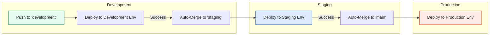
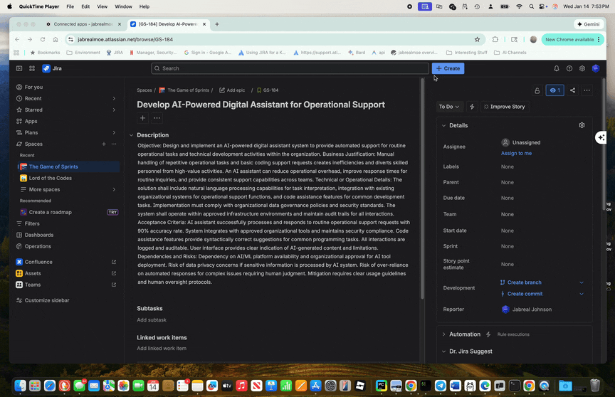
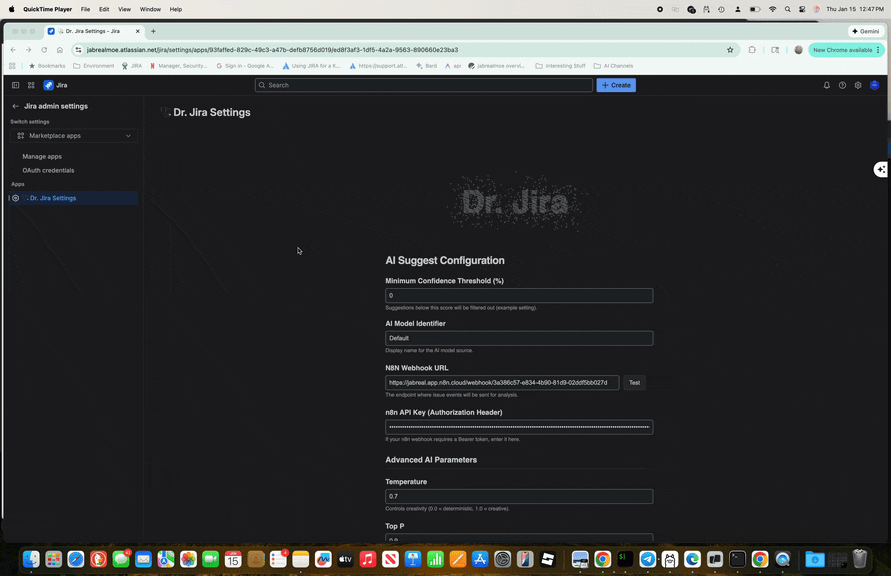
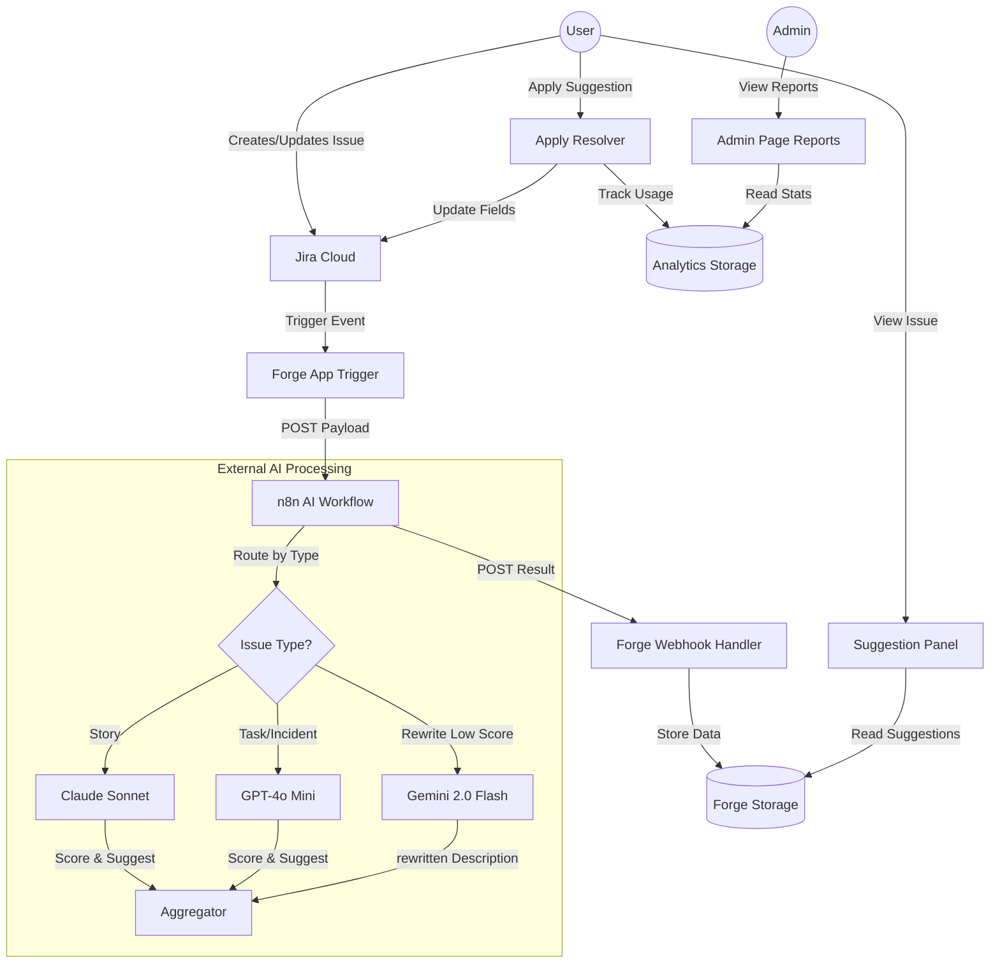

# AI Suggest - Jira Cloud Forge App

AI Suggest is a Jira Cloud Forge application designed to intelligently assist users by suggesting improvements to Jira issues. It leverages an external AI agent (via n8n webhooks) to analyze issue data and provide actionable suggestions, such as improved descriptions, summaries, or other enhancements.

## CI/CD Automation

This project uses a fully automated **Cascade CI/CD Pipeline** managed via GitHub Actions.

### Deployment Flow Strategy

Deployments follow a strict promotion path: **Development → Staging → Production**. Code must pass through each gate successfully to be promoted.

1.  **Development**: Work is pushed to the `development` branch. This triggers a deployment to the `development` environment.
    - _Promotion_: Upon success, the pipeline automatically merges the code into `staging` using a `chore(release)` commit.
2.  **Staging**: The push to `staging` triggers a deployment to the `staging` environment.
    - _Promotion_: Upon success, the pipeline automatically merges the code into `main` using a `chore(release)` commit.
3.  **Production**: The push to `main` triggers the final deployment to the `production` environment.

### Automated Commits

You will see automated commits in the history with the message format:

- `chore(release): Promote Development to Staging`
- `chore(release): Promote Staging to Production`

---

## Demos

  
  

### Dr. Jira Settings (Admin Page)

The **Admin Page** features a fully interactive **Particle Swarm** animation that responds to your theme (Blue in Light Mode, White in Dark Mode) and spells out "Dr. Jira". It allows you to configure the **AI Model**, **N8N Connection**, and **Confidence Thresholds** with a modern, stable UI.

  

## Use Case

When a Jira issue is created or updated, **AI Suggest** automatically triggers an analysis. It presents the user with a list of AI-generated suggestions directly within the Jira issue context panel. Users can review these suggestions and apply them with a single click, streamlining the issue refinement process.

## Key Features

- **Automated Analysis:** Listens for issue events and sends data to an n8n webhook for AI processing.
- **Contextual Suggestions:** Displays AI-generated suggestions (e.g., "Refine Description", "Add Acceptance Criteria") in a custom UI panel.
- **Review Before Applying:** Users can click on a suggestion card to view the full details in a modal before deciding to apply it.
- **One-Click Application:** select a suggestion to automatically update the Jira issue with the proposed changes.
- **Analytics & Reporting:** Built-in tracking of accepted suggestions to monitor AI model performance and usage metrics.
- **Visual Polish:**
  - **Premium UI:** Features a modern, clean interface with glassmorphism effects and smooth transitions.
  - **Dynamic Loaders:** Includes whimsical, randomized loading animations (Brain/Neural Pulse, Coffee, Magic, Oven, Lightbulb, Plant) to keep users engaged while waiting for AI analysis.
  - **Interactive Previews:** Detailed view features a slick **typewriter animation** for presenting AI-generated content.
  - **Match Scoring:** Displays a confidence score for each suggestion to help users gauge relevance.

## How It Works

1.  **Trigger:** A user opens a Jira issue or an event occurs.
2.  **Processing:** The app polls for suggestions generated by the backend AI agent.
3.  **Display:** While loading, a random delightful animation plays. Once ready, suggestions are listed with titles and confidence scores.
4.  **Interaction:**
    - Click a card to see the **Detailed View** (full description).
    - Click "Apply" to instantly update the Jira issue fields.

## AI Agent Workflow

The backend n8n workflow uses a sophisticated multi-agent routing system:

1.  **Issue Classification**: Incoming requests are analyzed and routed to a specialized AI Agent based on the Jira Issue Type:
    - **Story Agent** (Claude 3.5 Sonnet): Focuses on narrative flow, acceptance criteria, and user value.
    - **Task/Incident Agent** (GPT-4o Mini): Focuses on technical detail, severity assessment, and operational steps.
    - **Service Request Agent**: Validates approval chains and business justification.

2.  **Quality Scoring**: Every issue is evaluated against a strict rubric (0-100) covering clarity, scope, and risk.
3.  **Automatic Renovation**: If an issue's Quality Score falls **below 60**, it is automatically forwarded to a **Gemini 2.0 Flash** agent for a complete, standard-compliant rewrite.

## Tech Stack

- **Platform:** Atlassian Forge (Jira Cloud)
- **Frontend:** React, Vite, CSS Modules
- **Integration:** n8n (Webhook-based AI Agent)

## Configuration

You can configure the n8n connection, AI Model name, and the minimum confidence score threshold.

1.  In Jira, click the **Apps** dropdown in the top navigation bar.
2.  Select **Dr. Jira Settings**.
3.  **n8n Webhook URL**: Enter the full URL of your n8n webhook (e.g., `https://jabreal.app.n8n.cloud/webhook/...`).
4.  **n8n API Key**: Enter the `WEBTRIGGER_API_KEY` (Bearer token) for your webhook.
5.  **Test Connection**: Click the "Test" button to verify the app can reach your n8n instance.
6.  **Save Configuration**: Click "Save Configuration" to persist your settings.

## System Architecture

## Analytics & Reporting

The application includes a centralized **Reports Dashboard** for administrators:

- **Usage Telemetry**: Automatically tracks the AI model source (e.g., GPT-4, Claude) for every accepted suggestion.
- **Impact Analysis**: Visualizes the distribution of applied suggestions to measure which models are most effective.
- **Real-time Data**: The dashboard updates instantly as users interact with suggestions.
